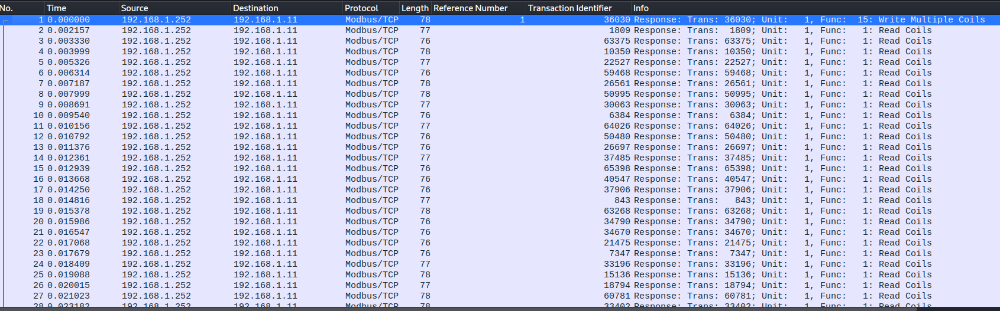
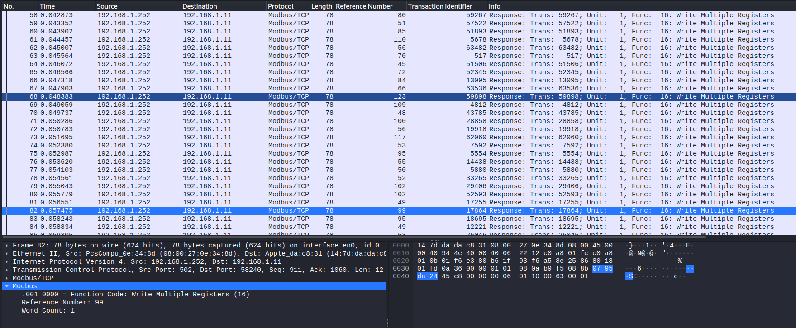

# Watch Tower (Scada Challenge)
HTB Business CTF 2023
Writeup by: @godylockz

## Challenge Description
Name: Watch Tower
Category: Scada
Difficulty: Very Easy
Points: 600
Our infrastructure monitoring system detected some abnormal behavior and initiated a network capture. We need to identify information the intruders collected and altered in the network.

## Challenge Files
tower_logs.pcapng
```text
tower_logs.pcapng: pcapng capture file - version 1.0
```

## Strategy
The premise revolving around this challenge was to identify any and all packets that could hold a flag such as `HTB{}`. The Wireshark capture had modbus packets that have different function codes such as:
1 	Read Coil  
2 	Read Discrete Input  
3 	Read Holding Registers  
4 	Read Input Registers  
5 	Write Single Coil  
6 	Write Single Holding Register  
15 Write Multiple Coils  
16 Write Multiple Holding Registers



When browsing the capture, `Function Code: Write Multiple Registers (16)` packets there are reference numbers. Clicking on the `Reference Number: 99` field, in the bottom-left corner of Wireshark, we can see it is called `modbus.reference_num`. 



Using `tshark` we can filter out all these reference numbers. Converting all these integers to ASCII characters could then be done with awk and the flag is displayed!
```sh
$ tshark -r tower_logs.pcapng -Y "modbus.func_code == 16"  -T fields -e 'modbus.reference_num'
52
76
82
48
80
..[snip]..
$ tshark -r tower_logs.pcapng -Y "modbus.func_code == 16"  -T fields -e 'modbus.reference_num' | awk '{split($0, a, " "); for(i=1; i<=length(a); i++) printf "%c", a[i]}'
4LR0P3Un8F-HTB{m0d8u5_724ff1c_15_un3nc2yp73d!@^}-r6ZJa0 
```

We could also 

Flag: `HTB{m0d8u5_724ff1c_15_un3nc2yp73d!@^}`
